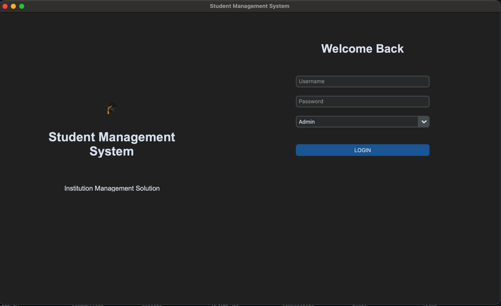
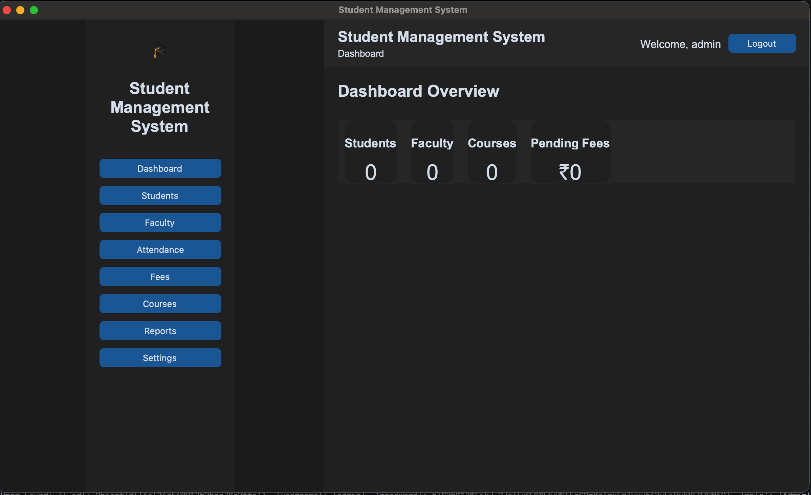
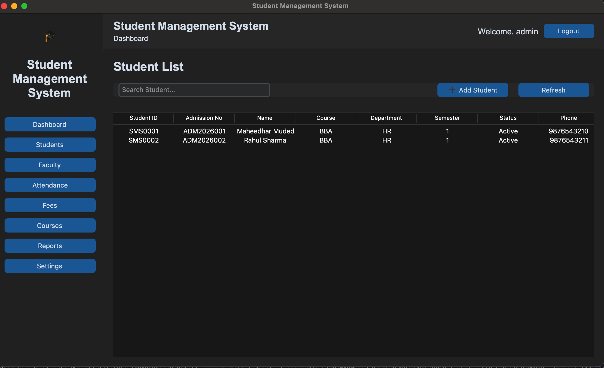
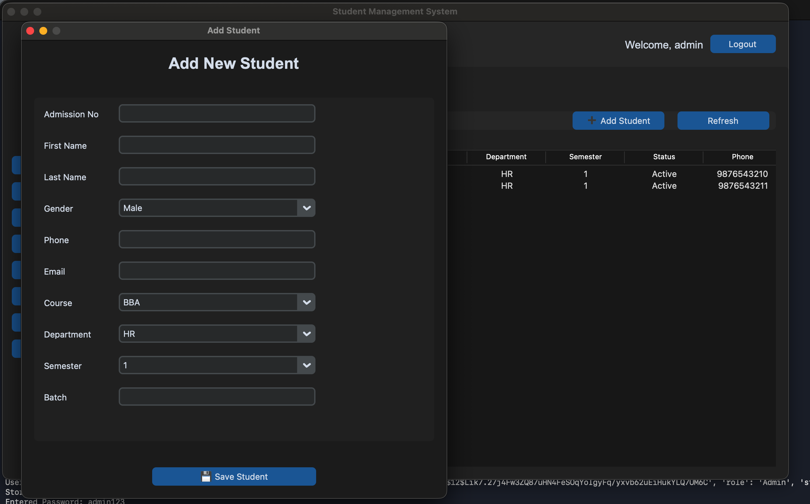

# 🎓 Student Management System

<div align="center">


A modern desktop **Student Management System** built with **Python**, **CustomTkinter**, and **MongoDB** using the **MVC (Model-View-Controller)** architecture.

</div>

---

# 📸 Application Screenshots

## 🔐 Login



---

## 📊 Dashboard



---

## 👨‍🎓 Student List



---

## ➕ Add Student



---

# ✨ Features

- 🔐 Secure Login Authentication
- 👥 Role-Based Access
- 📊 Dashboard Overview
- 👨‍🎓 Student Management
- ➕ Add New Students
- 🆔 Automatic Student ID Generation
- 💾 MongoDB Database Integration
- 🏗️ MVC Architecture
- ♻️ Reusable Form Builder
- 🧭 Dynamic Sidebar Navigation

---

# 🛠️ Technology Stack

| Technology | Purpose |
|------------|---------|
| Python 3.11 | Backend |
| CustomTkinter | Desktop GUI |
| MongoDB | Database |
| PyMongo | MongoDB Driver |
| bcrypt | Password Security |
| Git | Version Control |
| GitHub | Repository Hosting |

---

# 📂 Project Structure

```text
StudentManagementSystem
│
├── controllers/
├── database/
├── models/
├── services/
├── views/
│   ├── components/
│   ├── pages/
│   └── students/
├── screenshots/
├── app.py
├── config.py
├── requirements.txt
└── README.md
```

---

# 🚀 Installation

```bash
git clone https://github.com/mudedlamaheedhar7-MM/StudentManagementSystem.git
```

```bash
cd StudentManagementSystem
```

Create a virtual environment:

```bash
python -m venv venv
```

Activate it (macOS/Linux):

```bash
source venv/bin/activate
```

Install dependencies:

```bash
pip install -r requirements.txt
```

Run the application:

```bash
python app.py
```

---

# 🗺️ Roadmap

### ✅ Completed

- Login Authentication
- Dashboard
- Student List
- Add Student
- Automatic Student ID Generation
- MongoDB Integration

### 🚀 Coming Soon

- ✏️ Edit Student
- 🗑️ Delete Student
- 🔍 Live Search
- 📷 Student Photos
- 👨‍🏫 Faculty Module
- 📅 Attendance Module
- 💰 Fee Management
- 📄 PDF Reports
- 📤 Excel Export

---

# 👨‍💻 Author

**Maheedhar Mudedla**

GitHub: **https://github.com/mudedlamaheedhar7-MM**

---

## ⭐ Support

If you found this project useful, please consider giving it a **Star ⭐** on GitHub.